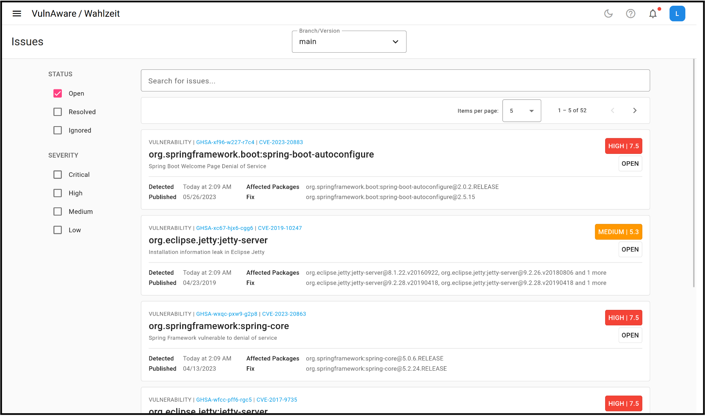
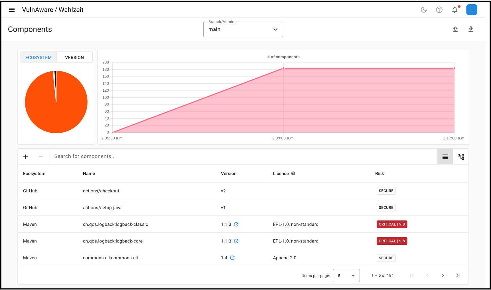

# VulnAware

The 'VulnAware' (vulnerability + awareness) project was part of my bachelor's thesis in 2023, conducted under the Professorship for Open-Source Software at the University of Erlangen-Nuremberg.
It allows users to upload their Software Bill of Materials (SBOM) to the platform, which then cross-references the included components with selected vulnerability databases.
Additionally, it offers continuous monitoring and alerts users when new vulnerabilities have been found.
The project is written in Java (Spring Boot) and TypeScript (Angular).

## User Interface

## License

[Apache-2.0](./LICENSE)
